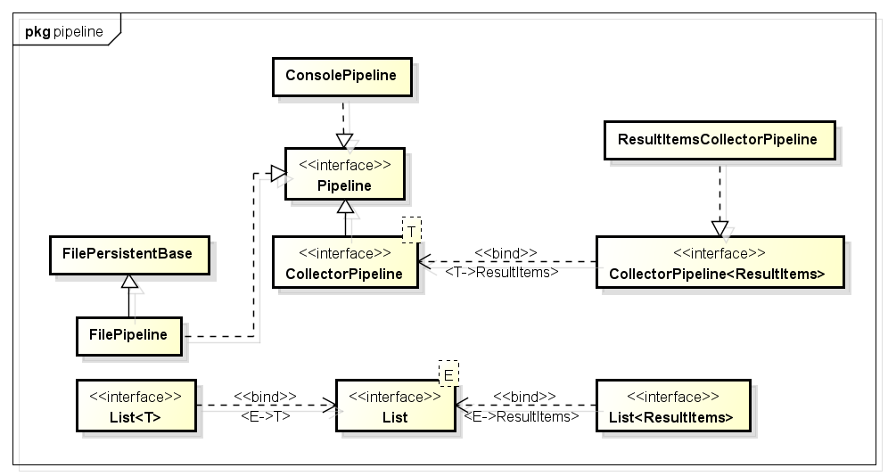
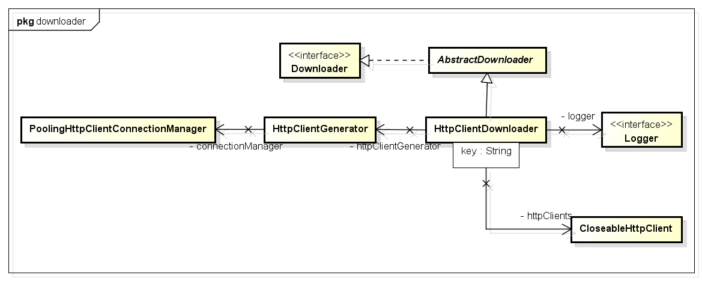
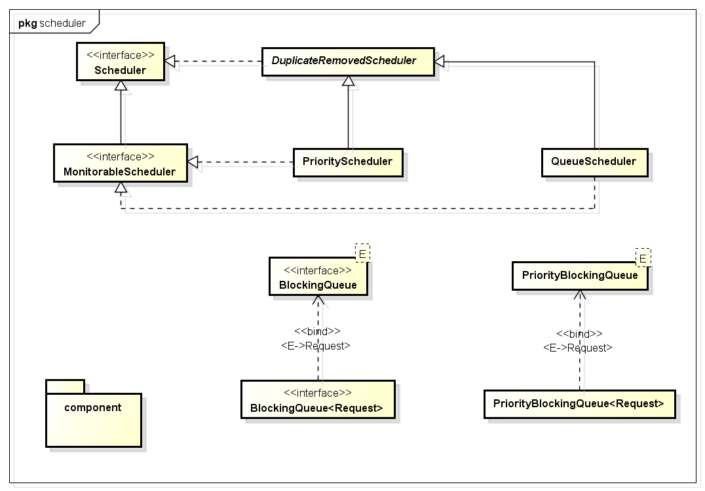

# webmagic类分析 #

## 爬虫流程分析 ##
爬虫的要素：1.调度器`schedule` 2.分析器`processor` 3.处理器`pipeline` 4.初始的种子

## Spider ##
Spider中的方法，返回值都是Spider，这样做的原因是可以进行链式的调用。

Spider的run方法主要其实就是调用了一个方法`processRequest(requestFinal)`，这个方法的作用是对request进行处理，使用download进行下载，存放到page中，并用pipeline处理page。

> Page page = downloader.download(request, this); 

## page ##
Page类将Downloader下载下来的HTML进行了封装，除了原始的HTML信息，还保存了原始请求`Request`，通过网页分析得到的新的target`List<Request> targetRequests`，`statusCode`，`String rawText`，等信息。

page中的STATUS_CODE，主要是用来进行代理的处理。

## Processor ##
Processor是个性化爬虫，改动最大的一个组件。如何处理网页，如何分析网页，都是需要我们自己进行定制的。
> public Site getSite() {
        return Site.me().setRetryTimes(3);
    }
如何设置重复抓取次数

## Pipeline ##

一个Request对应一个ResultItem ，ResultItem可以设置自己是否为可以skip的。

> ResultItems 中为啥用用linkedhashmap

## Downloader ##

> Q:HttpClientDownloader l52  单例模式下的同步块。
HttpClientGenerator 是干嘛的。

## Scheduler ##

**Schedule接口**是对url 的管理，他有两个方法，分别为Poll(将url分配给spider线程)和Push(将一个url放入spider的抓取队列)。

**MonitorableScheduler**：此接口继承自Scheduler接口，只是多提供了一个可以计数的功能。在此接口中，提供了方法，可以查看总共的request数目和剩余的request数目。

**DuplicateRemovedScheduler**：是一个抽象类，该类实现了Scheduler的接口。该类增加了去除重复url的功能，并只将不重复的url推送出去。

**QueueScheduler**：该类中，实际上只有一个LinkedBlockingQueue的成员变量。其他的方法，均是对该成员变量的操作。

## CountableThreadPool ##
用java.util.concurrent.ExecutorService实现的一个线程池,有两个特性:
1.	当线程池满的时候(alive的线程比线程池的num数量大的时候),停止进入
2.	可以计算出alive的线程数量

该类的execute方法,在各种判断后,实际执行的是executorService.execute()方法。

# webmagic使用 #
- 用正则表达式来匹配url：
  `  page.getUrl().regex(URL_POST).match()`

- 添加要爬取的页面
 ` page.addTargetRequests(page.getHtml().links().regex(URL_LIST).all(), 1);`

- 元素的抽取
   ` Html tempHtml =  Html.create("<table>"+questionList.get(i)+"</table>");
                String comment = tempHtml.xpath("//td[@class='title']//a/text()").toString();`
     
	返回所有的结果：
    List<String> questionList = html.xpath("").all()

	字段的抽取：String createTime = tempHtml.xpath("//td[3]/text()").toString();

框架思想：[http://progressdaily.diandian.com/post/2013-07-21/40050719031](http://progressdaily.diandian.com/post/2013-07-21/40050719031 "作者的博文")

